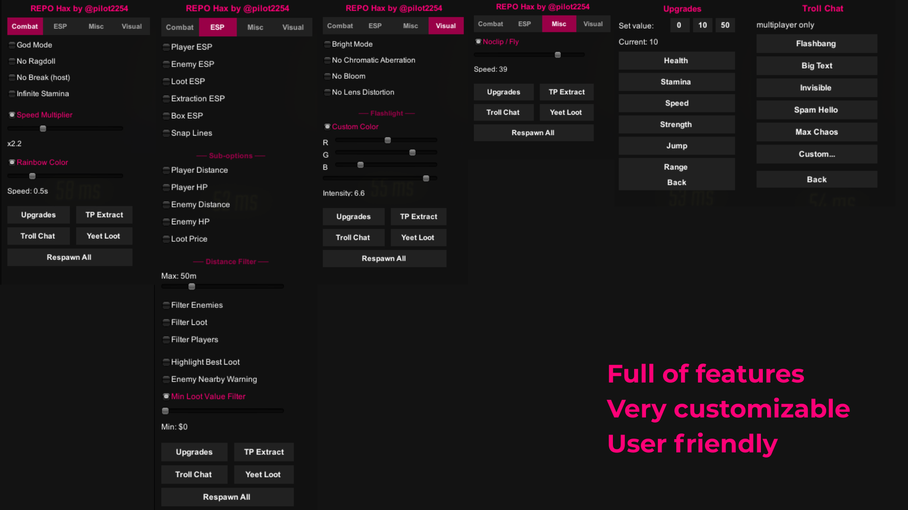

## how it looks

https://www.youtube.com/watch?v=ckBguthJdZw




## what is it

unity mono injection cheat for REPO - made for fun

inject with SharpMonoInjector after loading into a level (not main menu)

### features

**combat**
- god mode (invincible + health stays at 100)
- speed multiplier (1x - 5x, uses game's own speed system)
- no ragdoll (blocks damage/enemy ragdoll, voluntary tumble still works)
- no break (valuables cant take damage)
- infinite stamina
- rainbow color (cycles through all player colors, synced to everyone)

**esp**
- player esp (name, hp, distance)
- enemy esp (name, hp, distance)
- loot esp (item name + value)
- extraction esp (green = open, red = locked)
- box esp (draws a box around each entity)
- snap lines (draws a line from screen bottom to each entity)
- per-category distance filter
- loot overlay (always-on total loot value + item count in top-right)
- highlight best loot (marks the most valuable item on the map)
- min loot value filter (hides cheap items from esp)
- enemy nearby warning (banner when an enemy is within 10m)

**misc**
- noclip / fly mode
- tp to extraction (teleports you to the nearest unlocked extraction point)
- yeet loot (blasts all valuables away from you)
- upgrades menu (health/stamina/speed/strength/jump/range, takes effect next level)
- respawn all dead players
- troll chat (flashbang, big text, invisible messages, spam - multiplayer only)

**visual**
- bright mode (removes fog, boosts ambient light)
- no chromatic aberration
- no bloom
- no lens distortion
- flashlight custom color + intensity

### how to build and use
1. build the dll (release, .net 4.8, class library)
2. update project refs from `REPO_Data/Managed/`
3. launch game, load into a level
4. inject with [SMI](https://github.com/warbler/SharpMonoInjector) or any other mono injector
5. press insert in game

my non chatgpt note: written in an afternoon, tabbed menu added later because the single-scroll list got too long, enjoy updating its feats lads

## credits
- me (implementing all features)
- esp: https://github.com/Dark-Form/REPO-Internal
- respawn:
  - https://thunderstore.io/c/repo/p/ShaderLaze/Respawn/source/
- flashlight:
  - https://thunderstore.io/c/repo/p/JohnWhippits/REPOFlashLightColor/source/
  - https://thunderstore.io/c/repo/p/Megabyte21/BetterFlashlightMod/source/
- noclip + fly:
  - https://thunderstore.io/c/repo/p/SoloTeam/SO_Noclip/source/
  - https://thunderstore.io/c/repo/p/nickklmao/FreecamSpectate/source/
- clearUI:
  - https://thunderstore.io/c/repo/p/soundedsquash/Clear_UI/source/


---

# IMPORTANT

since there is a lot of people on github that report absolutely everything, i have to write notes like this one

1. this is NOT a paid cheat, please dont resell it
2. this is for edu purposes only and im not responsible for what u do with this shit
3. its meant for friend lobbies for fun
4. i didnt steal anything from the original creators, just modified it for my own needs

---

how to inject:
```
smi.exe inject -p REPO -a "C:\git-repos\repo-hax\cheat\bin\Release\cheat.dll" -n cheat -c Loader -m Load
```