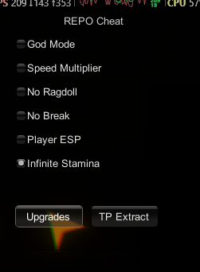
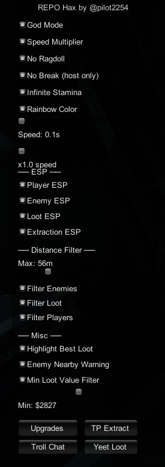
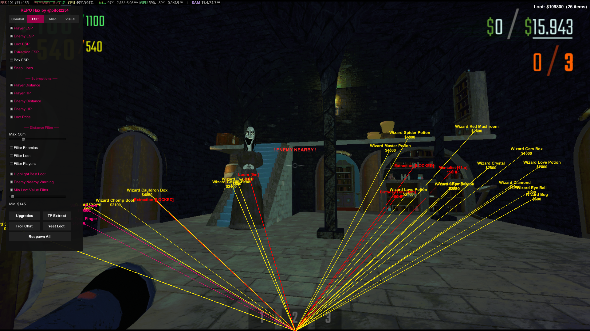

got bored one weekend and made this, enjoy

# repo-hax

## how it looks

s

## what is it

unity mono injection cheat for R.E.P.O - made for fun, not maintained

inject with SharpMonoInjector after loading into a level (not main menu)

features:
- god mode (invincible + health stays at 100)
- speed multiplier (1x - 5x, uses game's own speed system)
- no ragdoll (blocks damage/enemy ragdoll, voluntary tumble still works)
- no break (valuables cant take damage)
- player esp (name, hp, distance through walls)
- infinite stamina
- tp to extraction
- upgrades menu (health/stamina/speed/strength/jump/range, takes effect next level)

very easy to build and use, how to use:
1. build the dll (release, .net 4.8, class library)
2. update project refs from `REPO_Data/Managed/`
3. launch game, load into a level
4. inject with [SMI](https://github.com/warbler/SharpMonoInjector) or any other mono injector
5. press insert in game

my non chatgpt note: written in an afternoon, probably buggy, esp still buggy, upgrade changes only kick in after level transition, probably wont be updating this shit for too long, enjoy updating or porting its feats to your p2cs lads

note to myself:
```
smi.exe inject -p REPO -a "C:\git-repos\repo-hax\cheat\bin\Release\cheat.dll" -n cheat -c Loader -m Load
```

---

# IMPORTANT

since there is a lot of people on github that report absolutely everything, i have to write notes like this one

1. this is NOT a paid cheat, please dont resell it
2. this is for edu purposes only and im not responsible for what u do with this shit
3. its meant for friend lobbies for fun

---

## currently known bugs

esp not drawing correctly
